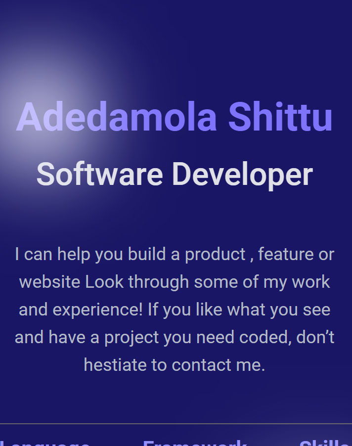

# Portfolio Project

In this project, the header and headline of the mobile view on my portfolio was worked on

# Project Name

**My Portfolio Project**

# Screenshot

## Header Image

## Headline Image

# Live Website

https://dammyshittu.github.io/Portfolio-Project/

# This project was built with:

HTML5
CSS3
Linters

# Version Control System

GIT

# Hosting Platform

Github

# Template Source

Figma

# 👤 Author

GitHub: [@dammyShittu](https://github.com/DammyShittu/)

Twitter: [@aded_shittu](https://twitter.com/aded_shittu/)

LinkedIn: [Adedamola Shittu](linkedin.com/in/adedamola-shittu-3ab465172/)

# 🤝 Contributing

Contributions, issues, and feature requests are welcome!

Feel free to check the issues page.

Show your support

Give a ⭐️ if you like this project!

# 📝 License

This project is MIT licensed.
