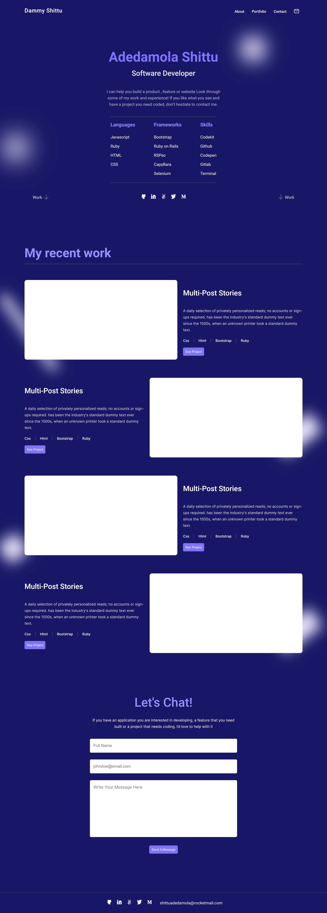
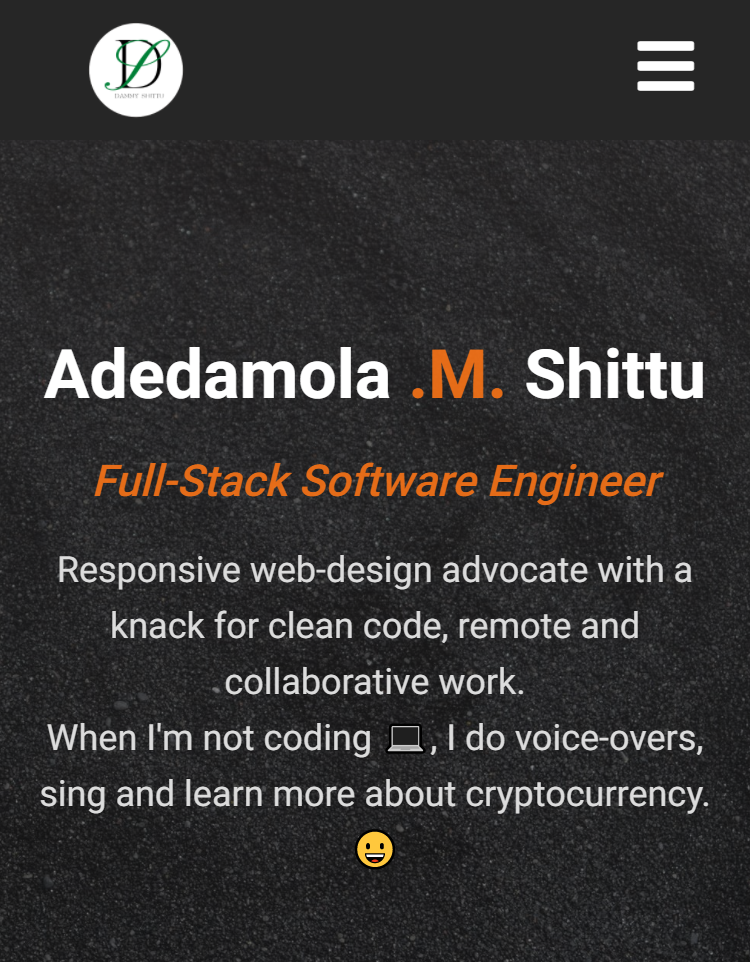

# Portfolio Project

This project contains my portfolio, coded according to requirements provided by Microverse Inc.

# Project Name

**My Portfolio Project**

# Screenshot

## Desktop View 

Width - 1440px

## Mobile View

Width - 375px

# Live Website

https://dammyshittu.github.io/Portfolio-Project/

# This project was built with:

HTML5

CSS3

Linters

# Version Control System

GIT

# Hosting Platform

Github

# Template Source

[Figma](https://www.figma.com/file/l7SqJ3ZfkAKih9sFxvWSR4/Microverse-Student-Project-1?node-id=23%3A10)

# 👤 Author

GitHub: [@dammyShittu](https://github.com/DammyShittu/)

Twitter: [@aded_shittu](https://twitter.com/aded_shittu/)

LinkedIn: [Adedamola Shittu](linkedin.com/in/adedamola-shittu-3ab465172/)

# 🤝 Contributing

Contributions, issues, and feature requests are welcome!

Feel free to check the issues page.

Show your support

Give a ⭐️ if you like this project!

# 📝 License

This project is MIT licensed.
